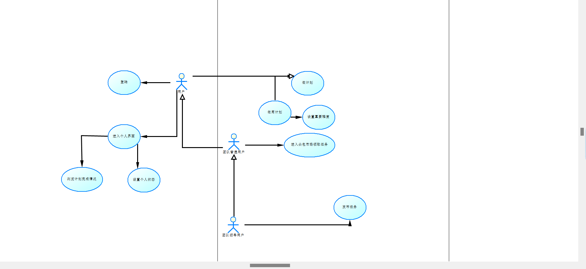
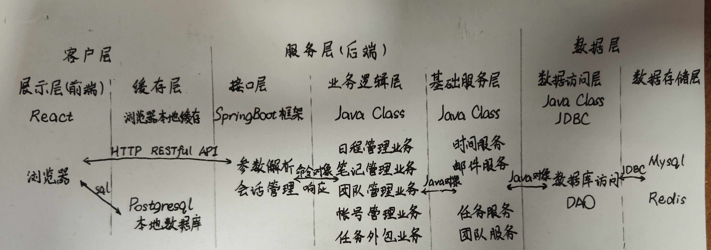
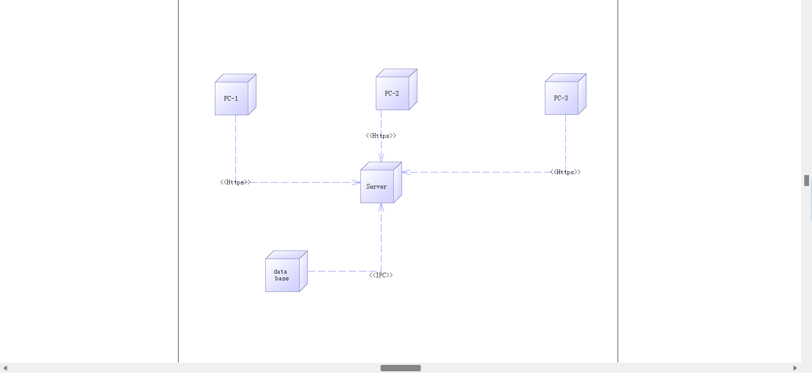
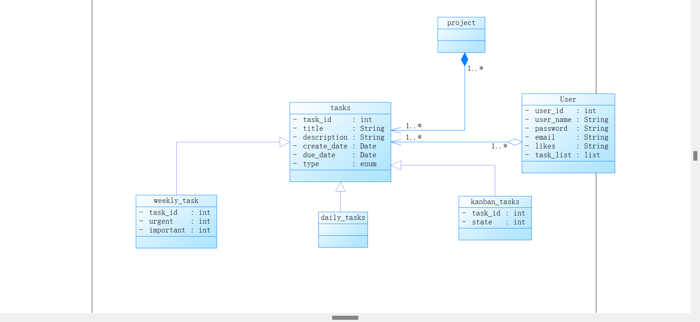

# 软件架构文档

## 简介

### 目的

本文档将从构架方面对系统进行综合概述，其中会使用多种不同的构架视图来描述系统的各个方面。它用于记录并表述已对系统的构架方面作出的重要决策。

### 参考资料

## 用例视图

典型用例如下：

- 用户在每日、每周和看板页面查看、修改、添加或删除任务
- 团队用户在各界面查看多人任务
- 团队领导用户创建多人任务

## 逻辑视图

### 概述

逻辑视图如下：

本项目逻辑架构采用分层架构，同时使用了前后端分离的非典型的MVC架构。

总体上分为客户层、服务层、数据层共三层。客户层细分为展示层和缓存层，展示层即前端由React框架实现，缓存层利用Postgresql数据库进行客户本地的缓存。客户层与服务层通过HTTP RESTful API进行连接通讯。服务层即后端，细分为接口层、业务逻辑层和基础服务层。接口层由SpringBoot框架实现，业务逻辑层和基础服务层由Java实现。服务层与数据层通过Java对象进行连接通讯。数据层细分为数据访问层和数据存储层，数据访问层由Java类和JDBC实现数据库访问DAO，数据存储层则有Mysql主数据库和Redis缓存数据库。

## 进程视图

由于本项目前端采用React框架，后端采用SpringBoot框架，进程管理由框架托管，故不需要额外的进程管理。

## 部署视图

部署视图如下所示：

由于本项目基于Web开发，故物理架构设计为B/S架构。手机、电脑等设备上的浏览器通过Internet与Web服务器进行连接，同时为了简化后端的部署，我们将Web服务器与数据库服务器部署在同一台机器上，因此Web服务器和数据库服务器通过本地网络或者进程间通信进行连接。

## 实现视图

本部分内容与逻辑架构最外层设计类似，构件分为前端、后端、数据库三部分。前两者通过HTTP RESTful API进行通讯，后两者通过Java对象和JDBC进行通讯。

## 技术视图

技术视图即技术栈的选型，这部分内容在逻辑视图中基本已经涉及，这里不加赘述。

## 数据视图(可选)

数据视图如下所示：

需要永久存储的数据主要有以上的类，其中`Task`类是各种任务的基类，`DailyTask`、`WeeklyTask`和`KanbanTask`继承自`Task`基类，而`Project`中包含多个`Task`。其余`User`等数据不做赘述。

## 核心算法设计(可选)

缓存机制：在前端需要获取数据时，程序会先尝试从本地浏览器缓存中获取数据，若缓存中没有数据则向服务器请求数据，同时将数据存入缓存中。同时，在后端更新数据时，后端也会更新缓存中的数据。

## 质量属性的设计

- 性能：通过缓存和并发技术提高系统性能
- 可拓展性：通过分层架构和前后端分离来提高可拓展性
- 安全性：通过用户的登录验证和权限控制来提高系统的安全性
